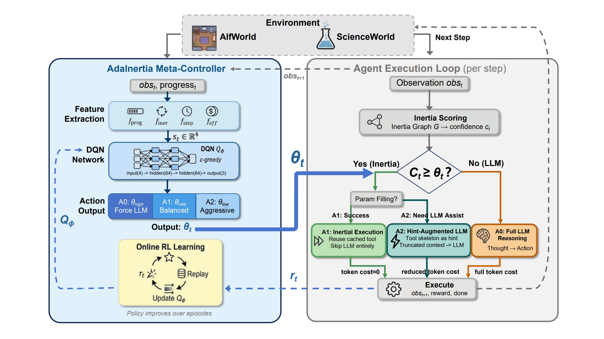

# AdaInertia: Dynamic Tool Usage Inertia Control via Deep Q-Learning for Efficient LLM Agent Reasoning

AdaInertia is an AutoTool-based framework that extends static tool-usage inertia with a lightweight Deep Q-Network (DQN) meta-controller. Instead of relying on a fixed inertia threshold, AdaInertia dynamically routes each reasoning step among deep LLM inference, conservative action reuse, and hint-enhanced fallback — adapting to real-time task difficulty and model capability.

> **Paper:** *AdaInertia: Dynamic Tool Usage Inertia Control via Deep Q-Learning for Efficient LLM Agent Reasoning* (under review)

---

## Method Overview

[](./docs/images/Method2_1.jpg)

> The figure above illustrates the AdaInertia framework. The DQN meta-controller observes a 4-dimensional efficiency-aware state vector and routes each step to one of three actions: forced deep reasoning (A₀), conservative inertia reuse (A₁), or hint-enhanced fallback (A₂).

---

## Key Results

- Reduces token consumption by up to **38.3%**
- Improves task success rate by up to **9.6%**
- Achieves up to **2.4× inference acceleration**
- Negligible controller overhead (**0.1% of LLM latency**)

Evaluated on **AlfWorld** and **ScienceWorld** benchmarks across multiple LLM backends (DeepSeek-V3, Qwen2.5-72B, GPT-4o-mini, Llama-3.3-70B, etc.).

---

## Environment Setup

The environment setup follows AutoTool. Please refer to:

- **[AutoTool](https://github.com/jiajingyyyyyy/AutoTool)** — for full dependency installation, AgentBoard environment configuration, and data preparation.

Notes specific to AdaInertia:

- Use your AdaInertia project root as `PROJECT_PATH`.
- Keep all paths in config/env based on `${PROJECT_PATH}` to avoid hard-coded absolute paths.

---

## Configuration

### 1. Create `.env` from template

```bash
cd autool
cp .env.example .env
```

Then edit `autool/.env`. Key fields:

| Variable | Description |
|---|---|
| `OPENAI_API_KEY` | Your API key (used for all providers via OpenAI-compatible interface) |
| `OPENAI_BASE_URL` | API endpoint, e.g. `https://api.deepseek.com/v1` for DeepSeek, `https://api.siliconflow.cn/v1` for SiliconFlow |
| `SIMCSE_MODEL_PATH` | Local path to the SimCSE model (used for inertia similarity computation) |
| `TRANSFORMERS_CACHE_DIR` | Cache directory for HuggingFace models |
| `TOOL_DESC_FILE` | Path to tool description JSON, typically `${PROJECT_PATH}/assets` |
| `MODEL_NAME` | Default model identifier, e.g. `qwen/qwen2.5-7b-instruct` |
| `TEMPERATURE` | Sampling temperature (default: `0`) |
| `TOP_P` | Nucleus sampling parameter (default: `0.95`) |
| `SEED` | Random seed for reproducibility (default: `42`) |

N-gram model fields (`NGRAM_*`) are optional and used for offline trajectory analysis.

### 2. Select model in YAML

Edit [eval_configs/main_results_all_tasks.yaml](eval_configs/main_results_all_tasks.yaml), section `llm:`.

Each key under `llm:` defines a named backend. Pass the key name via `--model` at runtime. Example — using DeepSeek:

```yaml
llm:
  DeepSeekChat:
    name: api
    engine: deepseek-chat
    api_base: https://api.deepseek.com/v1
    api_key: ${OPENAI_API_KEY}
    max_tokens: 4096
    temperature: 0.0
    context_length: 64000
    use_parser: true
```

To add a new provider, append a new key block under `llm:` with appropriate `engine`, `api_base`, and `api_key` fields.

### 3. Select agent type in YAML

Edit the `agent:` section in the same YAML file:

```yaml
agent:
  name: ReactInertiaAgent   # AdaInertia with RL meta-controller
  # name: ReactBaselineAgent  # Pure ReAct baseline (no inertia)
```

- `ReactInertiaAgent` — activates the DQN meta-controller and all inertia parameters
- `ReactBaselineAgent` — standard ReAct agent, all inertia/RL fields are ignored

Key inertia parameters (used when `name: ReactInertiaAgent`):

| Parameter | Description |
|---|---|
| `inertia_threshold` | Base similarity threshold for action reuse |
| `inertia_alpha` | Exponential smoothing factor for inertia score |
| `inertia_k` | Candidate actions to consider from the inertia graph |
| `inertia_fallback_hint` | Enable hint injection when fallback is triggered |

### 4. Configure tasks

In the same YAML file, section `env:` controls task-level settings. Select the task with `--tasks`. Supported tasks:

| Task key | Description |
|---|---|
| `alfworld` | AlfWorld household tasks (default 134 episodes) |
| `scienceworld` | ScienceWorld science experiments (default 90 episodes) |
| `tool-query` | Tool-use query evaluation |

---

## How To Run

Run from the project root. Always source `.env` first.

```bash
cd /path/to/AdaInertia
export PROJECT_PATH=$(pwd)
set -a && source autool/.env && set +a
```

### Example A: AlfWorld with DeepSeek (AdaInertia)

```bash
python agentboard/eval_main.py \
    --cfg-path eval_configs/main_results_all_tasks.yaml \
    --tasks alfworld \
    --model DeepSeekChat \
    --log_path ./results/alfworld_deepseek \
    --project_name adainertia_alfworld_deepseek \
    --baseline_dir ./data/baseline_results
```

### Example B: ScienceWorld with Qwen2.5-72B (AdaInertia)

```bash
python agentboard/eval_main.py \
    --cfg-path eval_configs/main_results_all_tasks.yaml \
    --tasks scienceworld \
    --model Qwen25-72B \
    --log_path ./results/scienceworld_qwen \
    --project_name adainertia_scienceworld_qwen \
    --baseline_dir ./data/baseline_results
```

### Example C: AlfWorld baseline (no inertia)

First set `agent.name: ReactBaselineAgent` in the YAML, then:

```bash
python agentboard/eval_main.py \
    --cfg-path eval_configs/main_results_all_tasks.yaml \
    --tasks alfworld \
    --model DeepSeekChat \
    --log_path ./results/alfworld_baseline \
    --project_name baseline_alfworld_deepseek \
    --baseline_dir ./data/baseline_results
```

---

## Practical Tips

- `--model` must match a key under `llm:` in [eval_configs/main_results_all_tasks.yaml](eval_configs/main_results_all_tasks.yaml).
- `--tasks` must match a key under `env:` in the same file.
- Always source `autool/.env` before running.
- Run one evaluation at a time in memory-constrained containers.
- `OPENAI_API_KEY` in `.env` is shared across all OpenAI-compatible providers — set it to the key for whichever provider you configure in `OPENAI_BASE_URL`.

---

## Troubleshooting

### API connection or authentication errors

- Confirm `OPENAI_BASE_URL` and `OPENAI_API_KEY` in `autool/.env` match your provider.
- Check whether environment proxy variables (`http_proxy`, `https_proxy`) interfere with API access.

### `--model` key not found

- Ensure the value passed to `--model` exactly matches a key under `llm:` in the YAML.
- Check that `engine` is a valid model ID for your provider.

### Process killed

- Typically caused by container memory pressure.
- Reduce `num_exam` in the YAML or run one task at a time.

---

## Repository Structure

```
AdaInertia/
├── agentboard/          # Core evaluation framework (agents, environments, prompts)
│   ├── eval_main.py     # Main evaluation entry point
│   ├── agents/          # ReactBaselineAgent, ReactInertiaAgent
│   ├── environment/     # AlfWorld, ScienceWorld wrappers
│   └── prompts/         # Per-agent, per-task prompt files
├── autool/              # Tool-graph and inertia utilities
│   └── .env.example     # Environment variable template
├── assets/              # Tool description files
├── eval_configs/
│   └── main_results_all_tasks.yaml  # Unified config for all tasks and models
├── docs/
│   ├── AdaInertia.tex   # Paper source
│   └── images/          # Figures
└── setup.py
```

---

## Acknowledgements

AdaInertia is built on top of [AutoTool](https://github.com/jiajingyyyyyy/AutoTool) and evaluated using the [AgentBoard](https://github.com/hkust-nlp/agentboard) benchmark suite. We thank the respective authors for their open-source contributions.

---
